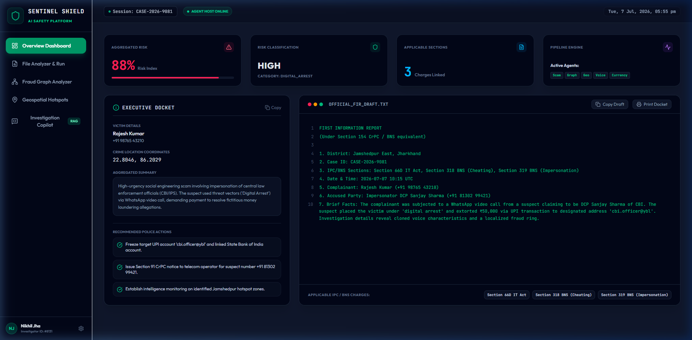
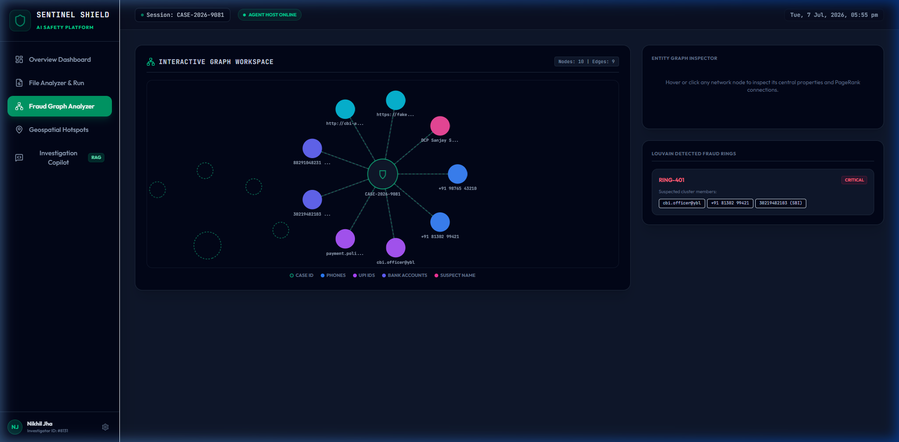

<div align="center">

# 🛡️ SentinelShield AI
### A Multi-Agent AI Platform for Public Safety & Fraud Intelligence

**Predict. Prevent. Protect.**


SentinelShield AI ingests a citizen's fraud report — statement, call recording, currency photo, and location — and turns it into a risk score, a fraud-network map, a crime hotspot view, and a legally-formatted FIR draft, in seconds.

[Features](#-features) • [Architecture](#-system-architecture) • [Screenshots](#-screenshots) • [Setup](#-installation--setup) • [API](#-api-reference) • [Roadmap](#-roadmap)

</div>

---

## 📖 Table of Contents

- [Problem Statement](#-problem-statement)
- [Solution Overview](#-solution-overview)
- [Features](#-features)
- [System Architecture](#-system-architecture)
- [Multi-Agent Workflow](#-multi-agent-workflow)
- [Tech Stack](#-tech-stack)
- [Project Structure](#-project-structure)
- [Screenshots](#-screenshots)
- [Installation & Setup](#-installation--setup)
- [Environment Variables](#-environment-variables)
- [Running the Application](#-running-the-application)
- [API Reference](#-api-reference)
- [Simulation Mode & Graceful Fallbacks](#-simulation-mode--graceful-fallbacks)
- [Team & Contributions](#-team--contributions)
- [Roadmap](#-roadmap)
- [Contributing](#-contributing)
- [License](#-license)

---

## 🎯 Problem Statement

Digital fraud — UPI scams, "digital arrest" extortion calls, government-impersonation calls, counterfeit currency, and organized fraud rings — is outpacing the manual capacity of citizen helplines and cybercrime cells. Today:

- **Evidence is fragmented.** A single incident produces a text statement, a call recording, a screenshot, and a location — all reviewed separately, with no automated way to correlate them.
- **Triage is slow and manual.** Officers must read, transcribe, and judge severity by hand, which doesn't scale with complaint volume.
- **Fraud networks stay invisible.** Complaints are handled in isolation, so shared phone numbers, UPI IDs, and bank accounts linking many victims to the same ring go unnoticed until too late.
- **Hotspots aren't predicted.** Without spatial/temporal analysis of past incidents, patrols and awareness campaigns can't be proactively targeted.
- **FIR drafting is inconsistent and slow.** Citing the right legal sections (BNS / IT Act) and assembling evidence takes time and varies by officer.

## 💡 Solution Overview

**SentinelShield AI** is a parallel, multi-agent AI pipeline that ingests every modality of evidence for a case at once, analyzes each with a purpose-built specialist agent, and fuses the results into one explainable risk score and case file.

Four design principles:

| Principle | What it means here |
|---|---|
| **Explainable AI (XAI)** | Every agent returns confidence scores, intent flags, and human-readable reasoning — not a black-box label. |
| **Multimodal Fusion** | Text, OCR'd images, audio, and GPS coordinates are routed to the agent that understands them, then combined by a Risk Aggregation Engine. |
| **Parallel Fan-Out** | Agents run concurrently, not sequentially, so triage takes seconds instead of manual review cycles. |
| **Graceful Degradation** | If heavy ML models or external databases (Neo4j, Qdrant, Postgres) are unavailable, every agent falls back to a lightweight local equivalent — the platform never breaks. |

---

## ✨ Features

- 🔍 **Automated multi-agent fraud triage** — statement + audio + image + location analyzed in parallel
- 🧾 **Auto-drafted FIR & executive summary**, mapped to BNS sections and IT Act clauses
- 🕸️ **Interactive fraud-network graph** — PageRank centrality + Louvain community detection to expose fraud rings
- 🗺️ **Geospatial hotspot mapping** — DBSCAN clustering with patrol-deployment recommendations
- 🎙️ **Deepfake / cloned-voice detection** on suspect call recordings
- 💵 **Counterfeit currency verification** via a custom YOLO detector
- 💬 **Legal Investigation Copilot** — hybrid RAG chat with citations and similar-case lookup
- 🖥️ **Cyber-defense styled React dashboard** with live pipeline-progress tracking
- 🧪 **Mocked-data mode (`USE_MOCKS`)** so the frontend runs standalone against realistic fixtures before/without a live backend
- 🛟 **Runs fully offline/degraded** — no GPU, API keys, or databases required for a complete demo

---

## 🏗️ System Architecture

```
                           Citizen / Police / Bank Portal
                                       │
                                       ▼
                                 API Gateway (FastAPI)
                                       │
                                       ▼
                      Multi-Agent AI Orchestrator (LangGraph)
                                       │
         ┌────────────────────────────────────────────────────────────┐
         │                                                            │
         ▼                                                            ▼
  Evidence Ingestion                                           Investigation Layer
         │                                                            │
         ▼                                                            ▼
  ┌───────────────────────────────────────────────────────────────────────────┐
  │                    Specialized AI Agents (Parallel Fan-Out)               │
  │                                                                           │
  │ • Scam Detection Agent (Zero-shot NLP Classifier / OCR)                   │
  │ • Voice Intelligence Agent (Cloned Voice Auditing / Deepfakes)            │
  │ • Counterfeit Detection Agent (Security Thread / Watermark Check)         │
  │ • Fraud Graph Intelligence Agent (PageRank Centrality / Louvain Rings)    │
  │ • Geospatial Intelligence Agent (DBSCAN Regional Hotspot Clustering)      │
  │ • Hybrid RAG Investigation Copilot (Legal precedent matching)            │
  │ • Evidence Generation Agent (Report compiling / FIR Drafting)            │
  └───────────────────────────────────────────────────────────────────────────┘
                                       │
                                       ▼
                            Risk Aggregation Engine
                                       │
                                       ▼
                     Reports • Alerts • Dashboards • APIs
```

### Orchestration (LangGraph State Machine)

```
               [ START ]
                   │
                   ▼
         route_evidence()  (conditional fan-out)
        /        │        \          \           \
       ▼         ▼         ▼           ▼           ▼
  scam_agent  graph_agent  geo_agent  voice_agent  counterfeit_agent
       \        │         /           /           /
        ▼       ▼        ▼           ▼           ▼
              risk_aggregation_node()
                   │
                   ▼
          should_run_rag()  (conditional gate)
             /         \
   (if query) ▼         ▼ (no query)
        rag_agent        │
              \          │
               ▼         ▼
           evidence_agent_node()
                   │
                   ▼
                [ END ]
```

Evidence is only routed to agents relevant to the inputs present (e.g. the voice agent only runs if an audio file was uploaded). All active branches converge at a single risk-aggregation step before optional legal research and final report generation.

---

## 🤖 Multi-Agent Workflow

| Agent | Purpose | Core Technique | Fallback |
|---|---|---|---|
| **Scam Detection** | Classify fraud intent from text/OCR | Zero-shot XLM-RoBERTa + EasyOCR/PyMuPDF | Rule-based keyword/intent scoring |
| **Voice Intelligence** | Detect cloned voices & coercive tactics | Whisper transcription + Librosa spectral analysis (AASIST) | — |
| **Counterfeit Currency** | Verify banknote authenticity | Custom YOLO detector (security thread, watermark, microprint) | — |
| **Fraud Graph Intelligence** | Expose fraud rings & key entities | PageRank + Louvain community detection over Neo4j | In-memory NetworkX graph |
| **Geospatial Intelligence** | Identify hotspots & patrol routes | DBSCAN with haversine distance (2 km radius) | Simulated coordinate baseline |
| **Hybrid RAG Copilot** | Answer legal/investigative questions | BGE-M3 embeddings + Qdrant + BM25 + RRF + cross-encoder rerank | Local keyword search index |
| **Evidence / FIR Generation** | Produce the final case file | Weighted logarithmic risk fusion → BNS-mapped FIR draft | — |

---

## 🛠️ Tech Stack

**Backend & Orchestration:** Python, FastAPI, LangGraph, LangChain, Pydantic, SQLAlchemy, Loguru, Uvicorn

**AI / ML:** XLM-RoBERTa (zero-shot), OpenAI Whisper, EasyOCR, Ultralytics YOLO, Librosa, BGE-M3, BM25 (rank-bm25), cross-encoder rerankers, PyTorch, scikit-learn

**Graph & Spatial Analytics:** NetworkX (PageRank, Louvain), DBSCAN, Neo4j (optional), GeoPandas, Folium

**Data Stores:** PostgreSQL, Redis, Neo4j, Qdrant, MinIO (all optional — with in-memory fallbacks)

**Frontend:** React 19, Vite, React Router, Tailwind CSS v4, Recharts, Lucide Icons, custom SVG rendering

**Document/Vision Processing:** PyMuPDF, pypdf, python-docx, pytesseract, OpenCV, Pillow

---

## 📂 Project Structure

```
sentinelshield-ai/
├── main.py                     # FastAPI REST API Gateway entrypoint
├── requirements.txt             # Python dependency manifest
├── services/                    # Multi-agent logic
│   ├── orchestrator/            # LangGraph state machine (graph.py, nodes.py, router.py)
│   ├── scam_agent/              # Text & OCR scam classifier
│   ├── voice_agent/              # Deepfake audio detection
│   ├── counterfeit_agent/        # Banknote verification
│   ├── graph_agent/              # PageRank / Louvain fraud network mapping
│   ├── geo_agent/                # DBSCAN coordinate clustering & hotspots
│   ├── rag_agent/                # Legal search RAG copilot
│   └── evidence_agent/           # FIR generator and report compiler
├── shared/                      # Shared models, schemas, configuration
│   ├── config.py                 # Singleton Settings loader (env vars)
│   ├── db.py                     # SQL, Redis, Neo4j, Qdrant connectors
│   └── schemas.py                 # Cross-agent shared Pydantic schemas
└── frontend/                     # React web portal
    ├── index.html
    ├── package.json
    └── src/
        ├── App.jsx                # Dashboard workspace panel views
        ├── index.css              # Tailwind v4 directives and theme
        └── main.jsx               # React root renderer
```

---

## 🖥️ Screenshots




---

## ⚙️ Installation & Setup

### Prerequisites
- Node.js v18+
- Python 3.12 or 3.14

### 1. Clone the repository
```bash
git clone https://github.com/<your-username>/SentinelShield-AI.git
cd SentinelShield-AI
```

### 2. Backend setup
```bash
# Minimal install (runs fully in simulation/fallback mode)
pip install fastapi uvicorn pydantic pydantic-settings python-multipart loguru networkx sqlalchemy

# Full install (enables real ML models — heavier, requires more disk/RAM)
pip install -r requirements.txt
```

### 3. Frontend setup
```bash
cd frontend
npm install
```

### 4. Configure environment variables
Copy the example file and fill in what you need (see [Environment Variables](#-environment-variables)):
```bash
cp .env.example .env
```

---

## 🔑 Environment Variables

All configuration is loaded from a `.env` file at the project root via `shared/config.py`. Every value has a safe default, so the app boots even with an empty `.env`.

| Variable | Default | Purpose |
|---|---|---|
| `DEBUG` | `false` | Toggle FastAPI debug mode |
| `SECRET_KEY` | `change-me-in-production` | App secret key |
| `POSTGRES_HOST` / `PORT` / `DB` / `USER` / `PASSWORD` | `localhost` / `5432` / `sentinelshield` / `sentinel` / `sentinel_pass` | PostgreSQL connection |
| `REDIS_HOST` / `PORT` / `DB` | `localhost` / `6379` / `0` | Redis cache connection |
| `NEO4J_URI` / `USER` / `PASSWORD` | `bolt://localhost:7687` / `neo4j` / `neo4j_pass` | Fraud graph database |
| `QDRANT_HOST` / `PORT` / `API_KEY` | `localhost` / `6333` / — | Vector database for RAG |
| `MINIO_ENDPOINT` / `ACCESS_KEY` / `SECRET_KEY` | `localhost:9000` / `minioadmin` / `minioadmin` | Evidence/report object storage |
| `LLM_PROVIDER` | `huggingface` | `huggingface` \| `groq` \| `openai` \| `gemini` \| `local` |
| `LLM_MODEL_NAME` | `mistralai/Mistral-7B-Instruct-v0.3` | Model used for generation |
| `HUGGINGFACEHUB_API_TOKEN` / `GROQ_API_KEY` / `OPENAI_API_KEY` / `GEMINI_API_KEY` | — | Provider API keys (only needed for the provider you select) |
| `EMBEDDING_MODEL` | `BAAI/bge-m3` | RAG embedding model |
| `WHISPER_MODEL_SIZE` / `WHISPER_DEVICE` | `base` / `cpu` | Voice transcription model |
| `YOLO_MODEL_PATH` / `YOLO_CONFIDENCE` | `shared/weights/yolo_currency.pt` / `0.6` | Counterfeit currency detector |
| `SCAM_CLASSIFIER_MODEL` / `SCAM_RISK_THRESHOLD` | `joeddav/xlm-roberta-large-xnli` / `0.5` | Scam intent classifier |
| `RAG_TOP_K` / `RAG_RERANKER_MODEL` | `5` / `cross-encoder/ms-marco-MiniLM-L-6-v2` | RAG retrieval settings |

> None of these are required to run the demo — leave `.env` empty (or omit it) and every agent automatically uses its local fallback.

---

## 🚀 Running the Application

### Step 1 — Start the backend
```bash
python main.py
```
Server starts at **`http://localhost:8000`**.

### Step 2 — Start the frontend (in a second terminal)
```bash
cd frontend
npm run dev
```
Portal loads at **`http://localhost:5173`**.

### Frontend-only mode (no backend running)
Set `USE_MOCKS = true` in the frontend config to develop the UI entirely against mocked JSON fixtures — useful while backend agents are still being built.

---

## 🔌 API Reference

| Endpoint | Method | Description |
|---|---|---|
| `/api/pipeline/upload` | `POST` | Full multi-agent pipeline. Accepts `multipart/form-data`: statement text, complainant name/contact, lat/lon, optional audio file, optional image file. Returns risk score, risk level, evidence package (FIR draft, executive summary, sections, recommended actions), and each agent's raw result. |
| `/api/agents/rag` | `POST` | Ask the Investigation Copilot a legal/case question. Body: `{ query, case_id, top_k }`. Returns answer, citations, similar case IDs, confidence, tokens used. |
| `/api/agents/scam/upload` | `POST` | Standalone scam classification for text or image. |
| `/api/agents/voice/upload` | `POST` | Standalone deepfake/voice-cloning classification for an audio file. |
| `/api/agents/counterfeit/upload` | `POST` | Standalone banknote authenticity check for an image. |

<details>
<summary><strong>Example response — <code>POST /api/pipeline/upload</code></strong></summary>

```json
{
  "case_id": "CASE-2026-9081",
  "overall_risk_score": 0.88,
  "risk_level": "HIGH",
  "evidence_package": {
    "fir_draft": "...",
    "executive_summary": "...",
    "ipc_sections": ["Section 66D IT Act", "Section 318 BNS"],
    "recommended_actions": ["..."]
  },
  "scam_result": { "risk_score": 0.9, "scam_type": "digital_arrest", "entities": {} },
  "voice_result": null,
  "counterfeit_result": null,
  "graph_result": { "fraud_rings": [], "pagerank_scores": {} },
  "geo_result": { "hotspots": [], "patrol_recommendations": [] },
  "errors": []
}
```
</details>

---

## 🔄 Simulation Mode & Graceful Fallbacks

SentinelShield AI runs fully interactive and demoable even without GPUs, paid API keys, or provisioned databases:

| Component | Full implementation | Fallback |
|---|---|---|
| Scam classification | Zero-shot XLM-RoBERTa transformer | Rule-based keyword/intent triggers |
| Fraud graph | Neo4j graph database | In-memory NetworkX (PageRank + Louvain) |
| Geospatial clustering | Historical coordinate baselines | Locally simulated complaint coordinates |
| Legal RAG search | Qdrant + BM25 + cross-encoder rerank | Local keyword search index |

The frontend's connection badge reflects this: **`AGENT HOST ONLINE`** (full backend) or **`SIMULATION MODE`** (fallback logic only) — the demo works identically either way.

---

## 👥 Team & Contributions

Built for a team hackathon under the theme of fraud detection and citizen safety. Responsibilities were split by layer:

| Contributor | Role | Scope |
|---|---|---|
| **Mayank Raj** | Backend & Orchestrator | FastAPI gateway (`main.py`), LangGraph state machine (`services/orchestrator/`), risk aggregation engine |
| **Gaurav Kumar Chaudhary** | AI Agents Engineer | Scam detection, voice intelligence (deepfake), and counterfeit currency agents |
| **Avik Sarkar** | Data & Intelligence Engineer | Fraud graph (PageRank/Louvain), geospatial (DBSCAN) agent, hybrid RAG copilot, and evidence/FIR generation agent |
| **Nikhil Kumar** | Frontend / Web Developer | React (Vite) investigation portal — built independently against mocked JSON (`USE_MOCKS` toggle) in parallel with backend development, then wired to the live API |

---

## 🗺️ Roadmap

- [ ] Integrate live bank/UPI transaction APIs for real-time transaction-graph enrichment
- [ ] Connect to national/state crime-record databases to replace simulated geospatial baselines
- [ ] Add authenticated, role-based access for citizens, bank compliance teams, and law enforcement
- [ ] Expand the RAG copilot's legal corpus to additional statutes and case law
- [ ] Deploy the orchestrator and agents as independently scalable microservices
- [ ] Add automated tests and CI pipeline

---

## 🤝 Contributing

Contributions are welcome. To contribute:

1. Fork the repository
2. Create a feature branch: `git checkout -b feature/your-feature`
3. Commit your changes: `git commit -m "Add your feature"`
4. Push to your branch: `git push origin feature/your-feature`
5. Open a Pull Request

Please open an issue first for major changes to discuss what you'd like to change.

---

## 📄 License

This project is licensed under the MIT License — see the [LICENSE](LICENSE) file for details.

---

<div align="center">

**SentinelShield AI** — Predict. Prevent. Protect.

</div>
